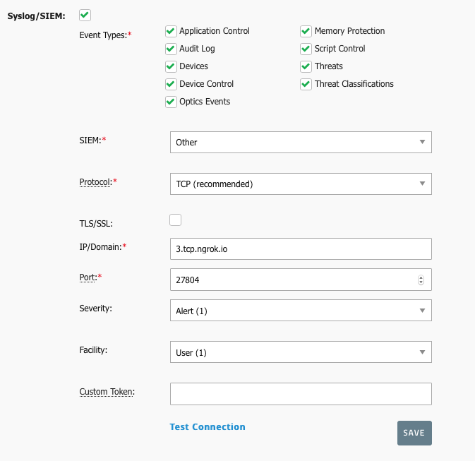

# Notification and Syslog routing Server
This `node.js` application routes incoming Syslogs from Cylance Optics to users
of the accompanying *Go Cylance React Native Application*

## What does this node.js server do?
- It takes incoming Syslog Messages from Cylance Optics, including threats and detections from devices
- It routes those messages to registered Android and iOS users through Firebase Cloud Messaging

### TCP Syslogs Server
- Takes incoming Syslog Optics messages, routes them to registered users

### HTTP Restful API Server
- `POST /register/` Register new users to the Database of users
- `POST /unregister/` Allows unregistration of user's signing out
- `GET /detections/` All syslogs
- `GET /detections/{DEVICE_ID}` All syslogs from a Cylance DEVICE_ID

# Requirements
- node. Tested and working on a few versions including: `node v15.12.0`, `v12.22.1`
- npm. Tested and working on a few version including: `npm v6.7.0`,  `v6.14.12`
- ngrok **premium** _(See how to Configure)_

# How to configure and run
- _Note: If you don't want to use Ngrok and are planning to develop on top of this server, you will have to develop in what is essentially a production environment._
- _Note: If you are simply deploying this server, you might just want to follow the Production steps_

## From your local Machine
1. Download the Firebase Admin config file (After correctly configuring with APN/Android) which comes in `.json` format. Copy the values into `./bin/config/firebase.json`
2. for **local** _(From a desktop or laptop)_ development you can use `ngrok` (premium) to port forward both the TCP server and HTTP server to somewhere accessible to the internet. The reason we need premium is to have static URL(s), and to be able to do *both* TCP and HTTP at the same time.
    - For TCP: `./ngrok tcp --remote-addr=3.tcp.ngrok.io:27804 20514`
        - Reroutes TCP connection from `3.tcp.ngrok.io` @ port `27804`, for example, and points it at local port of @ `20514`.
    - For HTTP  `./ngrok http -region=us -hostname=gocylance.ngrok.io 3000`
        - Reroutes HTTP connections from `gocylance.ngrok.io` to `localhost:3000`
    - _Why do I need Ngrok Premium for this?_
        - Ngrok free only allows one connection per free connection, this server requires TWO in development environment
        - Premium allows for static Hostnames that don't change randomly over hours allowing for a more stable development enviroment.
            - Ie. You will need to have `gocylance.ngrok.io` (or something to the similar affect) reserved so that you can input into Cylance Go React Native so that it can connect to it.  
3. run `npm install`
4. run `node app.js`
5. access your Cylance Protect web console.
6. fill out this form with the appropriate values from your configured ngrok

7. Press "Test Connection" and you will get some activity on your server console output. Once you press save all future Syslogs will be automatically forwarded to your server instance.

## On a production server
1. Download the Firebase Admin config file (After correctly configuring with APN/Android) which comes in `.json` format. Copy the values into `./bin/firebase.json`
2. have both ports (TCP, HTTP) accessible from the outside internet via your domain.
3. run `npm install`
4. run `node app.js`
5. access your Cylance Protect web console.
6. fill out this form with the appropriate values from your configured ngrok

7. Press "Test Connection" and you will get some activity on your server console output. Once you press save all future Syslogs will be automatically forwarded to your server instance.

## Connecting to the Cylance Go React Native Application
1. Copy the base url of the HTTP Endpoint you configured in either "From your local Machine" or "On a Production Server"
2. Run Application on either Virtualized (won't allow notifications) or Physical Device
3. Navigate to settings
4. input the Base URL in the form and attempt to connect.

# License
Apache 2.0
